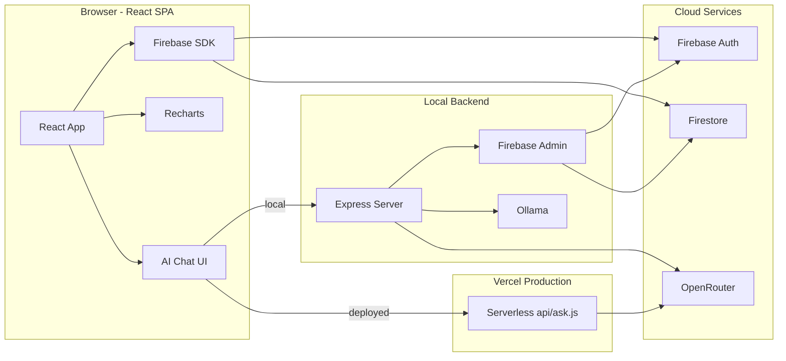
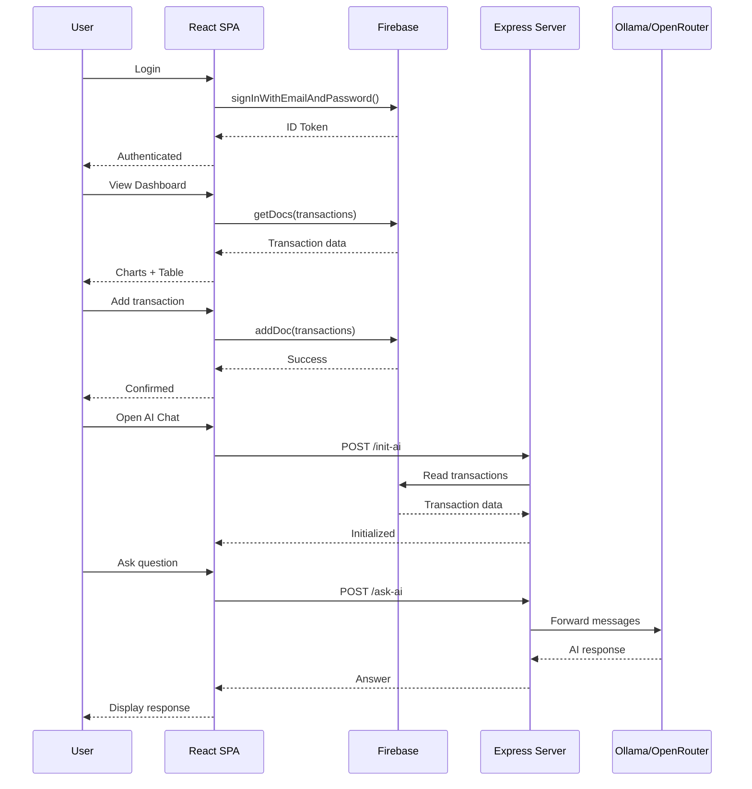
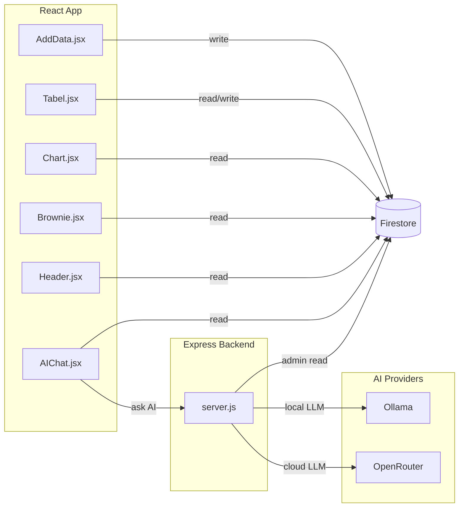
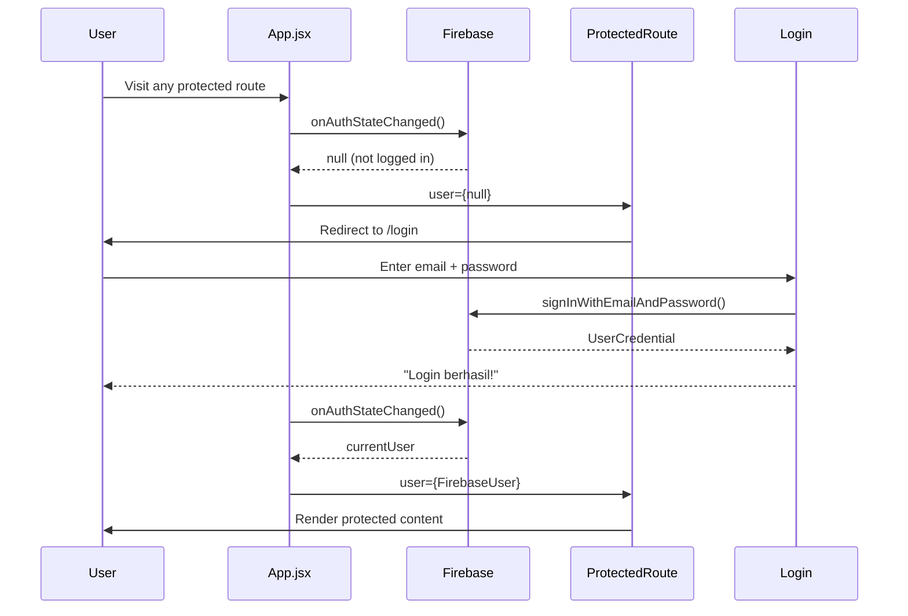
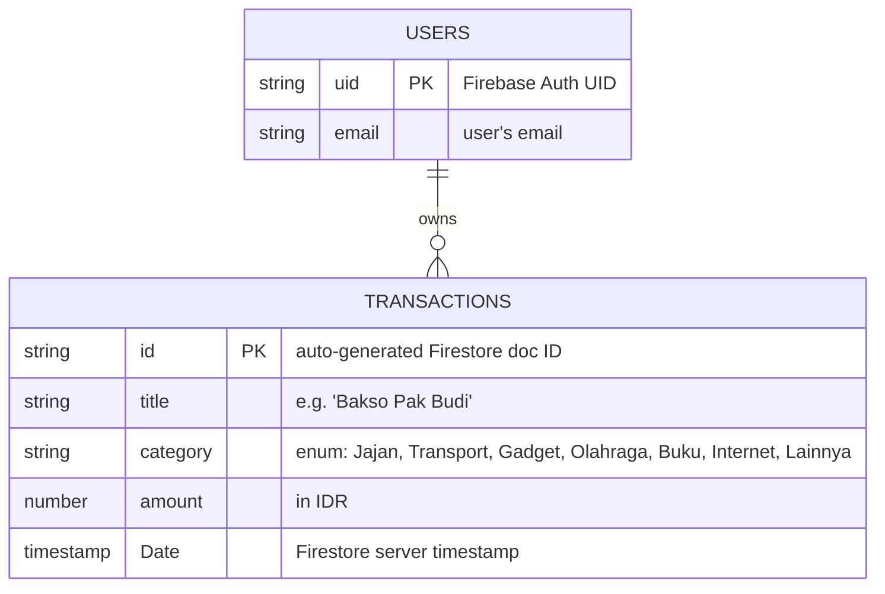

# FInDash-Pribadi — Project Documentation


## Table of Contents

1. [Project Overview](#1-project-overview)
2. [Technology Stack](#2-technology-stack)
3. [Architecture Overview](#3-architecture-overview)
4. [Project Structure](#4-project-structure)
5. [Feature Inventory](#5-feature-inventory)
6. [Authentication & Authorization](#6-authentication--authorization)
7. [Database Documentation](#7-database-documentation)
8. [API Documentation](#8-api-documentation)
9. [Environment Variables](#9-environment-variables)
10. [Local Development Guide](#10-local-development-guide)
11. [Common Development Workflows](#11-common-development-workflows)
12. [Important Design Decisions](#12-important-design-decisions)

---

## 1. Project Overview

### What This Application Does

FInDash-Pribadi is a **personal financial tracking dashboard** that helps users log, visualize, and analyze their daily expenses. It provides:

- **Transaction CRUD**: Add, edit, delete expense entries with title, category, amount, and date.
- **Dashboard visualizations**: Monthly total header, daily line chart, and a category-distribution "brownie" grid.
- **AI Financial Assistant**: A chat interface that answers questions about the user's spending using either a local LLM (Ollama) or cloud API.

### Main Business Purpose

The application is a **single-user personal finance tool** — not a multi-tenant SaaS. It is designed for an individual (the owner) to track daily spending in Indonesian Rupiah (IDR), organized by predefined categories.

### Primary Users

- **One person** (the developer-owner). The email/password authentication implies a single user or a small known set of users. There is no registration UI — credentials are managed directly in Firebase Console.

### Core Workflows

1. **Login** → Firebase email/password authentication.
2. **Add Transaction** → Fill form with title, category, amount, date → Saved to Firestore.
3. **View Dashboard** → See monthly total (`Header.jsx`), line chart (`Chart.jsx`), category grid (`Brownie.jsx`), and transaction table (`Tabel.jsx`).
4. **Edit / Delete** → Inline modal operations on table rows.
5. **Ask AI** → Chat with an LLM that has context of the user's last 50 transactions.

---

## 2. Technology Stack

### Frontend

| Technology | Version | Purpose | Source |
|---|---|---|---|
| React | ^19.2.6 | UI framework | `package.json` |
| Vite | ^8.0.12 | Build tool / dev server | `package.json` |
| react-router-dom | ^7.15.1 | Client-side routing | `package.json` |
| Recharts | ^3.8.1 | Line chart visualization | `package.json` |
| lucide-react | ^1.16.0 | Icon library (edit/delete) | `package.json` |
| react-markdown | ^10.1.0 | Markdown rendering in AI chat | `package.json` |
| remark-gfm | ^4.0.1 | GitHub-flavored markdown for AI chat | `package.json` |
| Tailwind CSS | CDN (latest) | Utility-first CSS | `index.html:14` |
| Firebase JS SDK | ^12.13.0 | Auth + Firestore client | `package.json` |

### Backend

| Technology | Version | Purpose | Source |
|---|---|---|---|
| Express | ^5.2.1 | HTTP server for AI API | `server/package.json` |
| Firebase Admin SDK | ^13.10.0 | Server-side Firestore + Auth verification | `server/package.json` |
| axios | ^1.16.1 | HTTP client for Ollama / OpenRouter | `server/package.json` |
| express-rate-limit | ^8.5.2 | Rate limiting middleware | `server/package.json` |
| cors | ^2.8.6 | CORS middleware | `server/package.json` |
| dotenv | ^17.4.2 | Environment variable loading | `server/package.json` |

### Serverless

| Technology | Purpose | Source |
|---|---|---|
| Node.js `fetch` (native) | OpenRouter API calls in Vercel serverless | `api/ask.js` |

### Database

| Technology | Purpose |
|---|---|
| **Firebase Firestore** (NoSQL) | All persistent data (transactions collection) |

### Authentication

| Technology | Purpose |
|---|---|
| **Firebase Authentication** (email/password) | User identity |

### Infrastructure

| Service | Purpose | Source |
|---|---|---|
| **Vercel** | SPA hosting + serverless function | `vercel.json` |
| **Firebase** | Auth + Firestore + Admin SDK | `src/firebase.js`, `server/server.js` |
| **Ollama** (optional) | Local LLM inference (localhost:11434) | `server/server.js:259` |
| **OpenRouter** (optional) | Cloud LLM API | `server/server.js:241`, `api/ask.js:22` |

---

## 3. Architecture Overview

### High-Level Architecture

The application follows a **three-part monorepo** architecture:



### Request Flow



### Data Flow



### Service Boundaries

| Service | Responsibility | Boundary |
|---|---|---|
| **React SPA** | UI rendering, client-side routing, direct Firestore CRUD, chart rendering | Browser |
| **Express Server** | AI conversation memory, LLM provider abstraction, Firebase token verification | Localhost :3001 |
| **Vercel Serverless** | AI proxy for production deployment (no memory) | `/api/ask` |
| **Firebase Auth** | Email/password authentication, ID token issuance | Cloud |
| **Firestore** | Persistent storage for all transaction data | Cloud |

### Major Modules

| Module | File(s) | Responsibility |
|---|---|---|
| **Auth** | `src/firebase.js`, `src/pages/Login.jsx`, `src/pages/ProtectedRoute.jsx` | Login/logout, route guarding, token management |
| **Add Transaction** | `src/pages/AddData.jsx` | Form input → Firestore write |
| **Dashboard** | `src/pages/Home.jsx` | Composition of Header, Chart, Brownie, Table |
| **Header Summary** | `src/pages/Header.jsx` | Current month total |
| **Line Chart** | `src/pages/Chart.jsx` | Daily expense line chart with 7d/30d/all filter |
| **Brownie Chart** | `src/pages/Brownie.jsx` | 10×10 category distribution grid |
| **Transaction Table** | `src/pages/Tabel.jsx` | Paginated table with search, filter, edit, delete |
| **AI Chat** | `src/pages/AIChat.jsx` | Chat UI with markdown rendering |
| **Edit Modal** | `src/pages/EditModal.jsx` | Edit transaction overlay |
| **Delete Modal** | `src/pages/DeleteModal.jsx` | Delete confirmation overlay |
| **AI Server** | `server/server.js` | Express server, token verification, LLM orchestration |
| **Serverless AI** | `api/ask.js` | Vercel function, OpenRouter proxy |

---

## 4. Project Structure

```
FInDash-Pribadi/
├── api/                          # Vercel serverless functions (production AI proxy)
│   └── ask.js                    #   POST /api/ask → OpenRouter
├── public/                       # Static assets served as-is
│   ├── favicon.svg
│   └── icons.svg
├── server/                       # Express backend (local development AI server)
│   ├── .env                      #   AI provider config (Ollama / OpenRouter keys)
│   ├── package.json              #   Backend dependencies
│   ├── server.js                 #   Express app: /init-ai, /ask-ai, /provider
│   └── serviceAccountKey.json    #   Firebase Admin SDK private key (COMMITTED — see #12)
├── src/                          # React frontend source
│   ├── assets/                   #   Static images (hero.png, logos)
│   ├── pages/                    #   All page/feature components
│   │   ├── About.jsx             #     Wraps Login (seems like placeholder)
│   │   ├── AddData.jsx           #     Add transaction form
│   │   ├── AIChat.jsx            #     AI Financial Assistant
│   │   ├── Brownie.jsx           #     Category distribution grid
│   │   ├── Chart.jsx             #     Recharts line chart
│   │   ├── DeleteModal.jsx       #     Delete confirmation dialog
│   │   ├── EditModal.jsx         #     Edit transaction dialog
│   │   ├── ErrorBoundary.jsx     #     React error boundary
│   │   ├── Header.jsx            #     Monthly spending summary
│   │   ├── Home.jsx              #     Dashboard (composes Header+Chart+Brownie+Tabel)
│   │   ├── Login.jsx             #     Firebase email/password auth
│   │   ├── ProtectedRoute.jsx    #     Auth guard wrapper
│   │   └── Tabel.jsx             #     Transactions table with CRUD
│   ├── App.jsx                   #   Root component: router, navbar, auth listener
│   ├── App.css                   #   Empty (all styling via Tailwind classes)
│   ├── firebase.js               #   Firebase client SDK init (Auth + Firestore)
│   ├── index.css                 #   Empty
│   └── main.jsx                  #   React entry point
├── .env                          # Frontend Firebase config + AI API URL
├── .gitignore
├── eslint.config.js              # ESLint flat config (v10)
├── index.html                    # Vite HTML entry (Tailwind CDN script)
├── package.json                  # Frontend manifest + scripts
├── vercel.json                   # Vercel SPA rewrites config
└── vite.config.js                # Vite build configuration
```

### Key Folder Responsibilities

| Directory | Responsibility |
|---|---|
| `src/pages/` | All feature components. No formal component/hook/util separation — everything lives here. |
| `server/` | Express backend. Only serves AI endpoints — does NOT proxy Firestore CRUD (client calls Firestore directly). |
| `api/` | Vercel serverless. Single-function fallback for AI in production. |
| `public/` | Static assets served from Vercel edge. |

---

## 5. Feature Inventory

| Feature | Description | Entry Point | Related Files |
|---|---|---|---|
| **Login / Logout** | Firebase email/password authentication with `onAuthStateChanged` listener | `Login.jsx` | `firebase.js`, `App.jsx`, `ProtectedRoute.jsx` |
| **Add Transaction** | Form with title, category, amount, date → writes to Firestore | `AddData.jsx` | `firebase.js` |
| **Dashboard View** | Composes Header, Chart, Brownie, Table into a single page | `Home.jsx` | All dashboard components |
| **Monthly Total** | Shows total expenses for the current month in IDR | `Header.jsx` | — |
| **Line Chart** | Recharts `LineChart` with 7-day, 30-day, all-time filters | `Chart.jsx` | — |
| **Category Grid** | 10×10 proportional grid showing category spending distribution | `Brownie.jsx` | — |
| **Transaction Table** | Paginated table with search (title), filter (category), edit/delete actions | `Tabel.jsx` | `EditModal.jsx`, `DeleteModal.jsx` |
| **Edit Transaction** | Pre-populated modal form that calls `updateDoc` | `EditModal.jsx` | `Tabel.jsx` |
| **Delete Transaction** | Confirmation dialog that calls `deleteDoc` | `DeleteModal.jsx` | `Tabel.jsx` |
| **AI Financial Assistant** | Chat interface with transaction-aware LLM (local: Express+Ollama/OpenRouter, deployed: Vercel+OpenRouter) | `AIChat.jsx` | `server/server.js`, `api/ask.js` |
| **AI Provider Switching** | Runtime toggle between Ollama and OpenRouter (local mode only) | `AIChat.jsx` | `server/server.js:310` |
| **Error Boundary** | Catches React render errors with reload button | `ErrorBoundary.jsx` | `App.jsx` |

---

## 6. Authentication & Authorization

### Login Flow



### Session Management

- **No server-side sessions**. Firebase handles session tokens client-side.
- The `onAuthStateChanged` callback in `App.jsx` (`src/App.jsx:19-24`) fires on page load and on auth state transitions.
- A loading spinner is shown while auth state resolves (`App.jsx:26-31`).
- The Firebase ID token is used for server authentication via `user.getIdToken()` in `AIChat.jsx` and verified server-side with `admin.auth().verifyIdToken()` in `server/server.js:58-91`.

### Roles & Permissions

**There are no roles or permissions**. Authentication is binary:

| State | Access |
|---|---|
| `user !== null` | Full access to all routes and features |
| `user === null` | Redirected to `/login`; cannot view any page |

The `user` prop is passed from `App.jsx` down through all child components, but only `Tabel.jsx` uses it for conditional rendering (shows/hides the "Aksi" actions column) (`src/pages/Tabel.jsx` — `{user && <th>...`}).

### Middleware

- **Client-side**: `ProtectedRoute.jsx` checks `user` prop and redirects to `/login` if null.
- **Server-side**: `verifyToken` middleware (`server/server.js:58-91`) checks `Authorization: Bearer <token>` header on all AI endpoints. Returns 401 if missing or invalid.
- **Rate limiting**: `express-rate-limit` at 30 requests/minute/IP on all Express routes (`server/server.js:48-53`).

### Auth Configuration

- **Firebase project**: `findash-pribadi` (Firebase console)
- **Auth method**: Email/Password only
- **Admin SDK**: Service account key at `server/serviceAccountKey.json` (project: `findash-pribadi`)

---

## 7. Database Documentation

### Database Type

**Firebase Firestore** — NoSQL, document-oriented, serverless.

### Collections

There is a **single collection**: `transactions`.

### Document Schema (Implicit — Defined by Usage)

The schema is not declared anywhere; it emerges from how documents are written and read across the application.

| Field | Type | Required | Written In | Read In |
|---|---|---|---|---|
| `title` | `string` | Yes | `AddData.jsx:42` | `Tabel.jsx`, `Header.jsx`, `Chart.jsx`, `Brownie.jsx`, `server/server.js`, `AIChat.jsx` |
| `category` | `string` (enum) | Yes | `AddData.jsx:43` | All readers |
| `amount` | `number` | Yes | `AddData.jsx:44` | All readers |
| `Date` | `Firebase Timestamp` | Yes | `AddData.jsx:47` | All readers (converted via `.toDate()`) |

### Categories (Enum Values)

Defined in `AddData.jsx:66-72` and used for filtering in `Tabel.jsx`:

| Category | Description |
|---|---|
| `Jajan` | Snacks / eating out |
| `Transport` | Transportation costs |
| `Gadget` | Gadget / electronics |
| `Olahraga` | Sports / fitness |
| `Buku` | Books / education |
| `Internet` | Internet / subscriptions |
| `Lainnya` | Other / miscellaneous |

### Data Access Patterns

| Pattern | Method | Used By |
|---|---|---|
| Read all (no filter) | `getDocs(collection(db, "transactions"))` | `Header.jsx`, `Chart.jsx`, `Brownie.jsx`, `AIChat.jsx` |
| Read all (ordered by date desc) | `query(collection(db, "transactions"), orderBy("Date","desc"))` | `Tabel.jsx` |
| Read (limited, server-side) | `db.collection("transactions").limit(50).get()` | `server/server.js` |
| Create | `addDoc(collection(db, "transactions"), {...})` | `AddData.jsx` |
| Update | `updateDoc(doc(db, "transactions", id), {...})` | `Tabel.jsx` |
| Delete | `deleteDoc(doc(db, "transactions", id))` | `Tabel.jsx` |

### Entity-Relationship Diagram

Since this is a single-collection NoSQL database with no relations, the ERD is minimal:



**Note**: The relationship between `USERS` and `TRANSACTIONS` is **implicit**. There is no `userId` field on transaction documents. The application operates as a single-user app, so no user-scoping is applied to queries.

### Migration Strategy

**No migration tooling exists.** Since Firestore is schemaless, schema changes are applied by writing new fields to documents. There are no migration scripts, seed files, or versioning.

---

## 8. API Documentation

### Express Server (Local) — `server/server.js`

Base URL: `http://localhost:3001`

#### `GET /`

Health check.

| | |
|---|---|
| **Auth** | None |
| **Response** | `{ "message": "AI Server Running" }` |

#### `POST /init-ai`

Initializes AI memory for the authenticated user. Fetches last 50 transactions from Firestore via Admin SDK and builds a system prompt.

| | |
|---|---|
| **Auth** | Required — `Authorization: Bearer <Firebase ID Token>` |
| **Response (success)** | `{ "success": true, "message": "AI initialized" }` |
| **Response (already init)** | `{ "success": true, "message": "Already initialized" }` |
| **Response (error)** | `{ "error": "Init AI failed" }` (500) |

#### `POST /ask-ai`

Sends a user question to the configured AI provider (Ollama or OpenRouter) using the initialized memory.

| | |
|---|---|
| **Auth** | Required — `Authorization: Bearer <Firebase ID Token>` |
| **Request body** | `{ "question": "string" }` |
| **Response (success)** | `{ "answer": "string" }` |
| **Response (error)** | `{ "error": "Question harus diisi" }` (400), `{ "error": "AI belum diinit" }` (400), `{ "error": "AI Error" }` (500) |
| **Rate limit** | 30 requests/minute/IP |

#### `GET /provider`

Returns the current AI provider.

| | |
|---|---|
| **Auth** | Required — `Authorization: Bearer <Firebase ID Token>` |
| **Response** | `{ "provider": "ollama" | "openrouter" }` |

#### `POST /provider`

Switches the AI provider at runtime.

| | |
|---|---|
| **Auth** | Required — `Authorization: Bearer <Firebase ID Token>` |
| **Request body** | `{ "provider": "ollama" | "openrouter" }` |
| **Response (success)** | `{ "success": true, "provider": "ollama" }` |
| **Response (error)** | `{ "error": "Provider harus 'ollama' atau 'openrouter'" }` (400) |

---

### Vercel Serverless — `api/ask.js`

Base URL: `/api/ask` (relative to deployment domain)

#### `POST /api/ask`

Proxies a full messages array to OpenRouter. Used in production/Vercel deployment.

| | |
|---|---|
| **Auth** | None (public) |
| **Request body** | `{ "messages": [{ "role": "system"|"user"|"assistant", "content": "string" }] }` |
| **Response (success)** | `{ "answer": "string" }` |
| **Response (error)** | `{ "error": "Messages required" }` (400), `{ "error": "OpenRouter API error (502)" }`, `{ "error": "AI Error" }` (500) |
| **Model** | Default: `openai/gpt-4o-mini`, configurable via `OPENROUTER_MODEL` env var |

#### `OPTIONS /api/ask`

CORS preflight. Returns 200 with `Access-Control-Allow-Origin: *`.

---

### Frontend Routes (React Router) — `App.jsx`

| Path | Component | Protected | Notes |
|---|---|---|---|
| `/` | `AddData` | Yes | Root path renders Add Transaction form |
| `/home` | `Home` (Dashboard) | Yes | Main dashboard: Header + Chart + Brownie + Table |
| `/adddata` | `AddData` | Yes | Duplicate of `/` |
| `/about` | `About` | Yes | Renders `<Login />` — seems like a placeholder |
| `/login` | `Login` | No | Login/logout page |
| `/ai` | `AIChat` | Yes | AI Financial Assistant |

---

## 9. Environment Variables

### Frontend (`/.env`)

| Variable | Required | Purpose | Source |
|---|---|---|---|
| `VITE_FIREBASE_API_KEY` | Yes | Firebase Web API key | `src/firebase.js:7` |
| `VITE_FIREBASE_AUTH_DOMAIN` | Yes | Firebase Auth domain | `src/firebase.js:8` |
| `VITE_FIREBASE_PROJECT_ID` | Yes | Firebase project ID | `src/firebase.js:9` |
| `VITE_FIREBASE_STORAGE_BUCKET` | Yes | Firebase storage bucket | `src/firebase.js:10` |
| `VITE_FIREBASE_MESSAGING_SENDER_ID` | Yes | Firebase sender ID | `src/firebase.js:11` |
| `VITE_FIREBASE_APP_ID` | Yes | Firebase app ID | `src/firebase.js:12` |
| `VITE_AI_API_URL` | No (default: `http://localhost:3001`) | Express server URL for AI | `src/pages/AIChat.jsx:9` |

### Backend (`/server/.env`)

| Variable | Required | Purpose | Source |
|---|---|---|---|
| `AI_PROVIDER` | No (default: `ollama`) | Which LLM provider to use | `server/server.js:35` |
| `OPENROUTER_API_KEY` | Conditional (required for OpenRouter) | OpenRouter API key | `server/server.js:235` |
| `OLLAMA_MODEL` | No (default: `gemma4:e2b`) | Ollama model name | `server/server.js:261` |
| `OPENROUTER_MODEL` | No (default: `google/gemma-3-27b-it:free`) | OpenRouter model name | `server/server.js:243` |
| `CORS_ORIGIN` | No (default: `http://localhost:5173`) | Allowed CORS origin | `server/server.js:41` |
| `FIREBASE_SERVICE_ACCOUNT` | No (fallback: file) | Service account JSON string | `server/server.js:16-17` |

### Vercel Environment (Set in Vercel Dashboard)

| Variable | Required | Purpose | Source |
|---|---|---|---|
| `OPENROUTER_API_KEY` | Yes (for deployed AI) | OpenRouter API key for serverless function | `api/ask.js:17` |
| `OPENROUTER_MODEL` | No (default: `openai/gpt-4o-mini`) | Model for deployed mode | `api/ask.js:29` |

---

## 10. Local Development Guide

### Prerequisites

- Node.js >= 18 (tested with 18+ for native `fetch` support — `api/ask.js` uses it)
- npm >= 9
- (Optional) Ollama installed locally for local LLM mode
- A Firebase project with:
  - Email/Password authentication enabled
  - Firestore database created
  - Web app registered (for client SDK config)
  - Service account key generated (for Admin SDK)

### Installation

```bash
# Clone the repository
git clone https://github.com/DaffaFIP/FInDash-Pribadi.git
cd FInDash-Pribadi

# Install frontend dependencies
npm install

# Install server dependencies
cd server && npm install && cd ..

# Create environment files
# Root .env already exists — update with your Firebase config
# server/.env already exists — update AI provider settings
```

### Setup

1. **Firebase Configuration**: Ensure the `.env` file has your Firebase Web SDK values (or use the existing ones).
2. **Firebase Admin SDK**: Place your service account key at `server/serviceAccountKey.json` (or set `FIREBASE_SERVICE_ACCOUNT` env var).
3. **AI Provider (optional)**:
   - For Ollama: Install Ollama, pull a model (e.g. `gemma4:e2b`), ensure it runs on `localhost:11434`.
   - For OpenRouter: Set `OPENROUTER_API_KEY` in `server/.env`.

### Running Locally

```bash
# Run both frontend Vite dev server and Express backend concurrently
npm run dev

# Or run them separately:
npm run dev:fe      # Frontend only (Vite on :5173)
npm run dev:server  # Backend only (Express on :3001)
```

The `dev` script (`package.json:7`) runs:
```bash
cd server && npm install && cd .. && concurrently -n fe,server -c cyan,yellow "vite" "node server/server.js"
```

This auto-installs server dependencies, then starts both Vite (frontend on `:5173`) and Express (backend on `:3001`).

### Using the Application

1. Open `http://localhost:5173`
2. Log in with Firebase credentials (managed in Firebase Console)
3. Add transactions via the form at `/` or `/adddata`
4. View dashboard at `/home`
5. Chat with AI at `/ai`

### Testing

**There is no testing infrastructure.** Neither `package.json` has testing dependencies, no test files exist, and no test script is configured. The server's test script is a placeholder (`echo "Error: no test specified" && exit 1`).

### Build

```bash
npm run build
```

Produces a static site in `dist/` (Vite output). The build is a standard Vite React build — single `index.html`, hashed JS/CSS bundles in `dist/assets/`.

### Deployment

The project is configured for **Vercel** deployment:

1. Connect the GitHub repo to Vercel.
2. Set environment variables in Vercel Dashboard:
   - Frontend vars: `VITE_FIREBASE_*`, `VITE_AI_API_URL` (set to your Vercel domain)
   - Serverless vars: `OPENROUTER_API_KEY`, `OPENROUTER_MODEL`
3. Deploy. Vercel will:
   - Build the frontend with `vite build`
   - Deploy `dist/` as static hosting
   - Deploy `api/ask.js` as a serverless function at `/api/ask`
4. SPA rewrites are handled by `vercel.json` — all non-`/api` routes serve `index.html`.

**Important**: The Express server (`server/`) is NOT deployed to Vercel. The AI chat falls back to the `/api/ask` serverless function in production. The provider switching feature is local-only.

---

## 11. Common Development Workflows

### How to Add a New Feature

1. **Identify where it fits**: All components are in `src/pages/`. If the feature is a new page, add a new file there.
2. **Create the component**: Use the same pattern as existing pages — functional component, `useState`/`useEffect` hooks.
3. **Add a route**: In `src/App.jsx`, add a `<Route>` inside the `<Routes>` block, wrapping with `<ProtectedRoute>` if auth is needed.
4. **Add a nav link**: In the navbar section of `App.jsx`, add a `<Link>`.
5. **Style with Tailwind**: Use Tailwind utility classes directly (loaded via CDN).

Example — adding an "Analytics" page:
```jsx
// src/pages/Analytics.jsx
export default function Analytics({ user }) {
  return <div className="p-6 bg-slate-100 min-h-screen">...</div>;
}

// src/App.jsx
<Route path="/analytics" element={
  <ProtectedRoute user={user}><Analytics user={user} /></ProtectedRoute>
} />
```

### How to Create a New API

The Express server (`server/server.js`) is the only custom API. To add a new endpoint:

1. Add a route handler after existing ones.
2. Use `verifyToken` middleware if auth is needed.
3. Follow the existing error handling pattern (try/catch with JSON error responses).

Example:
```js
app.post("/analyze", verifyToken, async (req, res) => {
  try {
    const { data } = req.body;
    // ... logic ...
    res.json({ result: "..." });
  } catch (err) {
    console.log(err);
    res.status(500).json({ error: "Analysis failed" });
  }
});
```

### How to Add a New Database Table

Since Firestore is schemaless, "adding a table" means adding a new collection:

1. In the relevant component, use `collection(db, "newCollection")` to reference it.
2. Use `addDoc`, `getDocs`, `updateDoc`, `deleteDoc` as needed (import from `firebase/firestore`).
3. There are no migrations to run — new collections are created on first document write.

If you need to add a new field to the `transactions` document, simply include it in the object passed to `addDoc` or `updateDoc`. Old documents will simply lack the field — handle this with optional chaining in readers.

### How to Deploy Changes

1. Push/merge to the `main` branch.
2. Vercel auto-deploys from the linked GitHub repository.
3. For Express server changes: these only affect local development. For production changes, modify `api/ask.js` (the serverless function).
4. For Firestore security rules: update in Firebase Console (not part of this repo).

## 12. Important Design Decisions

### Why Firebase Firestore Instead of SQL?

The application tracks a single collection of simple transaction records with no complex relationships. Firestore provides:
- Zero-configuration setup (no schema, no migrations)
- Real-time capabilities (not currently used, but available)
- Tight integration with Firebase Auth
- Serverless scaling (no database server to manage)

**Trade-off**: No relational queries, no aggregation (SUM, GROUP BY), no server-side pagination. All aggregation (monthly totals, category breakdowns, date grouping) happens client-side in `useMemo` hooks.

### Why Dual AI Architecture (Express + Vercel Serverless)?

The Express server (`server/server.js`) provides:
- Per-user conversation memory (in-memory `Map`)
- Runtime provider switching (Ollama ↔ OpenRouter)
- Longer timeouts (300s for OpenRouter, 600s for Ollama)

The Vercel serverless function (`api/ask.js`) provides:
- Zero-config production deployment (Vercel handles it)
- No server management
- Stateless (each request is independent — messages are sent client-side)

The client (`AIChat.jsx`) auto-detects which mode to use via `window.location.hostname` — if localhost, use Express; otherwise use Vercel.

**Trade-off**: The deployed version has no conversation memory and no provider switching. Each request sends the full message history.

### Why Client-Direct Firestore Access Instead of a Backend API?

The frontend reads and writes Firestore directly using the client SDK (`firebase/firestore`) rather than routing through the Express server. The Express server is only used for AI endpoints.

**Why**: CRUD operations are simpler and faster without a backend proxy. Firebase Security Rules handle access control. The AI server needs Admin SDK access to read transactions for the LLM context, but it uses its own service account, not user credentials.

**Trade-off**: No server-side validation, no audit logging, no ability to add business logic to CRUD operations.

### Why No State Management Library?

The application has a simple data flow: fetch once on mount, display in charts/table, mutate via modals. React's built-in `useState` and `useEffect` suffice for this scope.

**Trade-off**: As seen in the repeated data fetching across `Header.jsx`, `Chart.jsx`, `Brownie.jsx`, and `Tabel.jsx` — each component independently fetches the same data. A shared state solution (React Context, React Query, or Zustand) would reduce network calls.

### Why Tailwind via CDN Instead of npm?

The CDN script tag (`index.html:14`) requires no build configuration. It was likely the fastest way to add utility CSS to a Vite project without installing PostCSS, Tailwind CLI, and configuring the Vite plugin.

**Trade-off**: No tree-shaking (all Tailwind classes are included), no custom config (colors, spacing, breakpoints cannot be customized without the npm package), and a runtime performance cost from the CDN script.

### Why No Testing?

The project is a personal tool. The developer presumably tests manually. There are no other contributors who would benefit from automated testing.

**Trade-off**: Regression risk on every change. No safety net for refactoring.

### Why JavaScript Instead of TypeScript?

Likely developer preference or faster prototyping. The application is small enough that TypeScript's benefits (type safety, autocompletion) are less critical.

**Trade-off**: No type checking for Firestore document shapes, no IDE autocompletion for props, runtime errors that TypeScript would catch at compile time.
